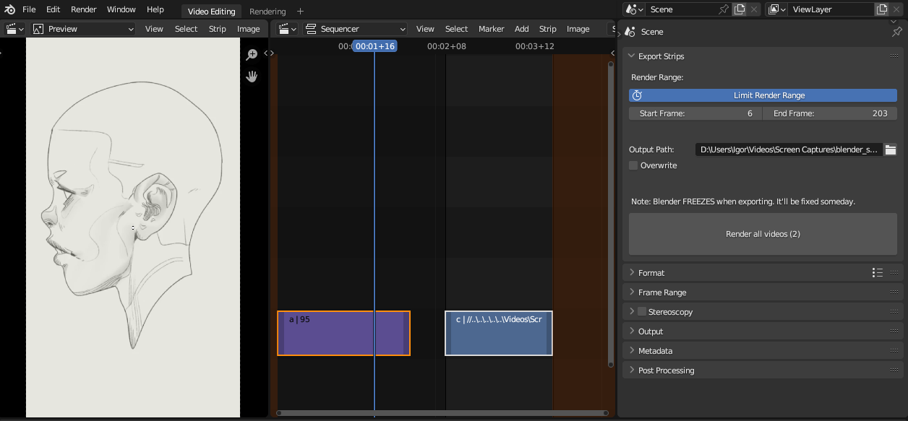

# Blender Strips Exporter
Blender add-on to export each strip in VSE as an individual video file.
**Tested on W11 running blender 3.4**

## Installation

To install the Strips Exporter add-on:

1. Download the `strips_exporter.py` file from this repository.
2. Open Blender and go to `Edit > Preferences > Add-ons`.
3. Click the `Install...` button and select the file.
4. Enable the Strips Exporter add-on by checking the box next to its name in Blender settings.

---

# To-do:
- [ ] fix freeze when rendering videos.
- [ ] fix categories so it matches Blender's conventions.
